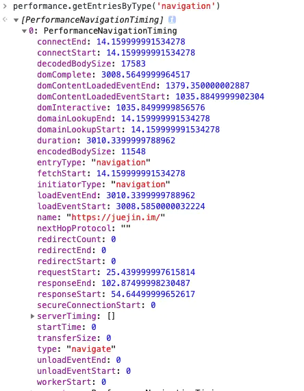
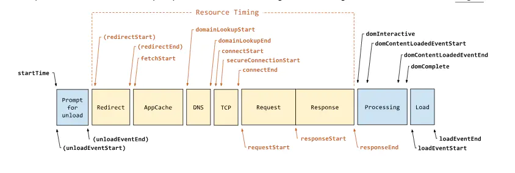

# 监控

> 监控一般分为三种，页面埋点、性能监控以及异常监控

### 页面埋点

+ PV (即页面浏览量或点击量，用户每1次对网站中的每个网页访问均被记录1个PV。用户对同一页面的多次访问，访问量累计，用以衡量网站用户访问的网页数量。) / UV (Unique visitor)
+ 停留时长
+ 流量来源
+ 用户交互

```text
对于这几类统计，一般的实现思路大致可以分为两种，分别为手写埋点和无埋点的方式

可以自主选择需要监控的数据然后在相应的地方写入代码。这种方式的灵活性很大，但是唯一的缺点就是工作量较大，每个需要监控的地方都得插入代码

无埋点的方式基本不需要开发者手写埋点了，而是统计所有的事件并且定时上报。这种方式虽然没有前一种方式繁琐了，但是因为统计的是所有事件，所以还需要后期过滤出需要的数据
```

### 性能监控

> 对于性能监控来说，其实我们只需要调用 performance.getEntriesByType('navigation') 这行代码就行了。





### 异常监控

> 对于代码运行错误，通常的办法是使用 window.onerror 拦截报错。该方法能拦截到大部分的详细报错信息

+ 对于跨域的代码运行错误会显示 Script error. 对于这种情况我们需要给 script 标签添加 crossorigin 属性
+ 对于某些浏览器可能不会显示调用栈信息，这种情况可以通过 arguments.callee.caller 来做栈递归
+ 对于异步代码来说，可以使用 catch 的方式捕获错误。比如 Promise 可以直接使用 catch 函数，async await 可以使用 try catch
