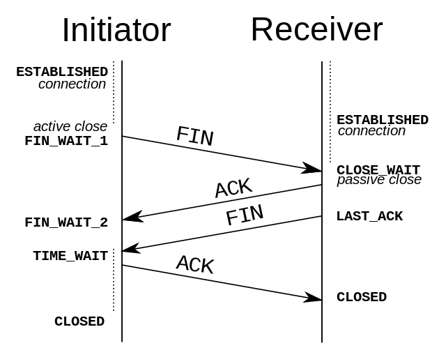
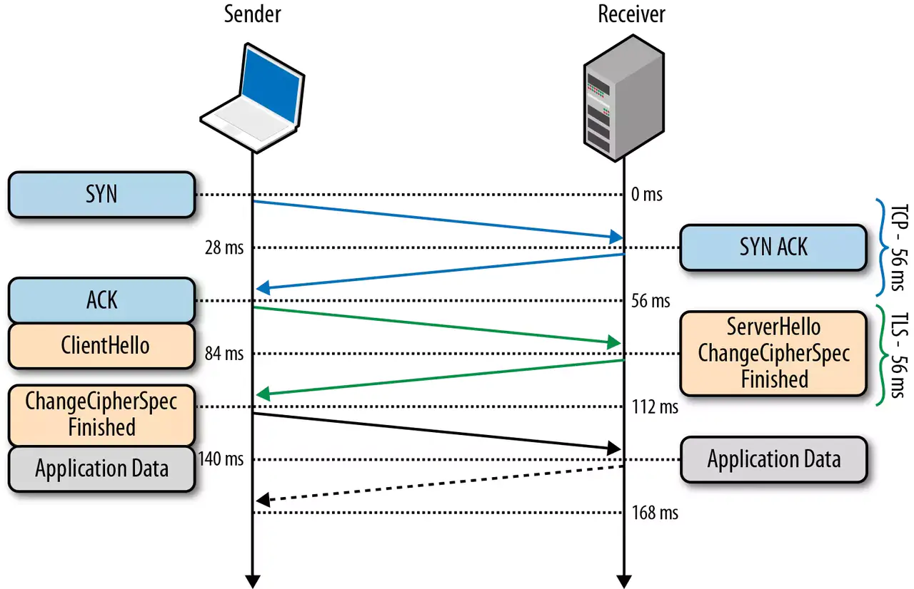

# 网络知识

## 1. UDP

> 首先 UDP 协议是面向无连接的，也就是说不需要在正式传递数据之前先连接起双方。然后 UDP 协议只是数据报文的搬运工，不保证有序且不丢失的传递到对端，并且UDP 协议也没有任何控制流量的算法，总的来说 UDP 相较于 TCP 更加的轻便

### 面向无连接

> 首先 UDP 是不需要和 TCP 一样在发送数据前进行三次握手建立连接的，想发数据就可以开始发送了

+ 在发送端，应用层将数据传递给传输层的 UDP 协议，UDP 只会给数据增加一个 UDP 头标识下是 UDP 协议，然后就传递给网络层了
+ 在接收端，网络层将数据传递给传输层，UDP 只去除 IP 报文头就传递给应用层，不会任何拼接操作

### 不可靠性

> 网络环境时好时坏，但是 UDP 因为没有拥塞控制，一直会以恒定的速度发送数据。即使网络条件不好，也不会对发送速率进行调整。这样实现的弊端就是在网络条件不好的情况下可能会导致丢包，但是优点也很明显，在某些实时性要求高的场景（比如电话会议）就需要使用 UDP 而不是 TCP

### 高效

+ 两个十六位的端口号，分别为源端口（可选字段）和目标端口
+ 整个数据报文的长度
+ 整个数据报文的检验和（IPv4 可选 字段），该字段用于发现头部信息和数据中的错误

### 传输方式

> UDP 不止支持一对一的传输方式，同样支持一对多，多对多，多对一的方式，也就是说 UDP 提供了单播，多播，广播的功能

### 适合场景

**直播**

TCP 会严格控制传输的正确性，一旦有某一个数据对端没有收到，就会停止下来直到对端收到这个数据。这种问题在网络条件不错的情况下可能并不会发生什么事情，但是在网络情况差的时候就会变成画面卡住，然后再继续播放下一帧的情况。

但是对于直播来说，用户肯定关注的是最新的画面，而不是因为网络条件差而丢失的老旧画面，所以 TCP 在这种情况下无用武之地，只会降低用户体验

## 2. TCP

> TCP 基本是和 UDP 反着来，建立连接断开连接都需要先需要进行握手。在传输数据的过程中，通过各种算法保证数据的可靠性，当然带来的问题就是相比 UDP 来说不那么的高效

**三次握手**

+ `第一次握手`客户端向服务端发送连接请求报文段。该报文段中包含自身的数据通讯初始序号。请求发送后，客户端便进入 SYN-SENT 状态。
+ `第二次握手`服务端收到连接请求报文段后，如果同意连接，则会发送一个应答，该应答中也会包含自身的数据通讯初始序号，发送完成后便进入 SYN-RECEIVED 状态。
+ `第三次握手`当客户端收到连接同意的应答后，还要向服务端发送一个确认报文。客户端发完这个报文段后便进入 ESTABLISHED 状态，服务端收到这个应答后也进入 ESTABLISHED 状态，此时连接建立成功

**为什么 TCP 建立连接需要三次握手，明明两次就可以建立起连接?**

```text
为了防止出现失效的连接请求报文段被服务端接收的情况
在建立连接中，任意一端掉线，TCP 都会重发 SYN 包，一般会重试五次，在建立连接中可能会遇到 SYN Flood 攻击。遇到这种情况你可以选择调低重试次数或者干脆在不能处理的情况下拒绝请求
```

**断开链接四次挥手**

+ `第一次挥手` 若客户端 A 认为数据发送完成，则它需要向服务端 B 发送连接释放请求
+ `第二次挥手` B 收到连接释放请求后，会告诉应用层要释放 TCP 链接。然后会发送 ACK 包，并进入 CLOSE_WAIT 状态，此时表明 A 到 B 的连接已经释放，不再接收 A 发的数据了。但是因为 TCP 连接是双向的，所以
  B 仍旧可以发送数据给 A
+ `第三次挥手` B 如果此时还有没发完的数据会继续发送，完毕后会向 A 发送连接释放请求，然后 B 便进入 LAST-ACK 状态。
+ `第四次挥手` A 收到释放请求后，向 B 发送确认应答，此时 A 进入 TIME-WAIT 状态。该状态会持续 2MSL（最大段生存期，指报文段在网络中生存的时间，超时会被抛弃） 时间，若该时间段内没有 B 的重发请求的话，就进入
  CLOSED 状态。当 B 收到确认应答后，也便进入 CLOSED 状态



## 3. http

> Post 和 Get 的区别？

```text
首先先引入副作用和幂等的概念。

副作用指对服务器上的资源做改变，搜索是无副作用的，注册是副作用的。

幂等指发送 M 和 N 次请求（两者不相同且都大于 1），服务器上资源的状态一致，比如注册 10 个和 11 个帐号是不幂等的，对文章进行更改 10 次和 11 次是幂等的。因为前者是多了一个账号（资源），后者只是更新同一个资源。

在规范的应用场景上说，Get 多用于无副作用，幂等的场景，例如搜索关键字。Post 多用于副作用，不幂等的场景，例如注册。
```

+ Get 请求能缓存，Post 不能
+ Post 相对 Get 安全一点点，因为Get 请求都包含在 URL 里（当然你想写到 body 里也是可以的），且会被浏览器保存历史纪录。Post 不会，但是在抓包的情况下都是一样的
+ URL有长度限制，会影响 Get 请求，但是这个长度限制是浏览器规定的，不是 RFC 规定的
+ Post 支持更多的编码类型且不对数据类型限制

### 头部

**通用头部**

```text
通用字段              作用
Cache-Control         控制缓存的行为
Connection            浏览器想要优先使用的连接类型，比如 keep-alive
Date                  创建报文时间
Pragma                  报文指令
Via                 代理服务器相关信息
Transfer-Encoding                 传输编码方式
Upgrade                 要求客户端升级协议
Warning                 在内容中可能存在错误
```

### http2和http3

+ HTTP/2 通过多路复用、二进制流、Header 压缩等等技术，极大地提高了性能，但是还是存在着问题的
+ QUIC 基于 UDP 实现，是 HTTP/3 中的底层支撑协议，该协议基于 UDP，又取了 TCP 中的精华，实现了即快又可靠的协议

## 4. TLS

> HTTPS 还是通过了 HTTP 来传输信息，但是信息通过 TLS 协议进行了加密。TLS 协议位于传输层之上，应用层之下。首次进行 TLS 协议传输需要两个 RTT ，接下来可以通过 Session Resumption 减少到一个 RTT。

**对称加密**

对称加密就是两边拥有相同的秘钥，两边都知道如何将密文加密解密。

这种加密方式固然很好，但是问题就在于如何让双方知道秘钥。因为传输数据都是走的网络，如果将秘钥通过网络的方式传递的话，一旦秘钥被截获就没有加密的意义的。

**非对称加密**

有公钥私钥之分，公钥所有人都可以知道，可以将数据用公钥加密，但是将数据解密必须使用私钥解密，私钥只有分发公钥的一方才知道。
这种加密方式就可以完美解决对称加密存在的问题。假设现在两端需要使用对称加密，那么在这之前，可以先使用非对称加密交换秘钥。


