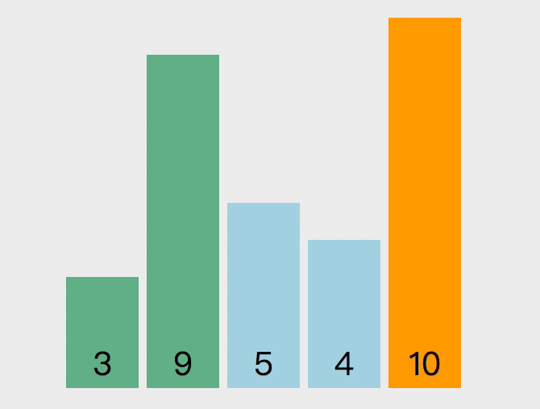
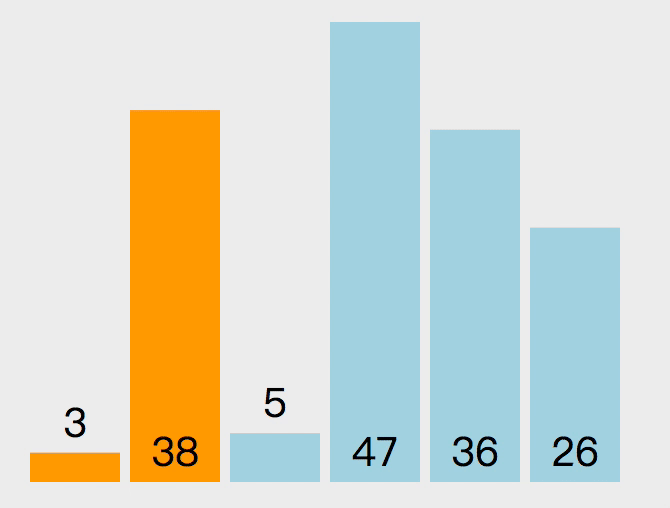
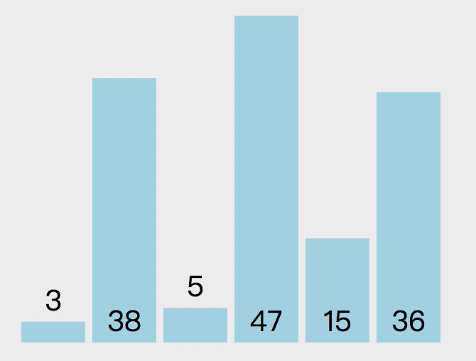

## 常用排序

### 冒泡排序

> 冒泡排序原理：从第一个元素开始，把当前元素和下一个索引元素进行比较。如果当前元素大，则交换位置，重复比较到最后一个元素，那么此时最后一个元素就是该数组中最大的数。下一轮重复以上操作，但此时最后一个已经是最大数，所以不需要比较最后，只需比较到length - 2的位置

`该算法的操作次数是一个等差数列 n + (n - 1) + (n - 2) + 1 ，去掉常数项以后得出时间复杂度是 O(n * n)`



### 插入排序

> 插入排序的原理如下。第一个元素默认是已排序元素，取出下一个元素和当前元素比较，如果当前元素大就交换位置。那么此时第一个元素就是当前的最小数，所以下次取出操作从第三个元素开始，向前对比，重复之前的操作



`该算法的操作次数是一个等差数列 n + (n - 1) + (n - 2) + 1 ，去掉常数项以后得出时间复杂度是 O(n * n)`

### 选择排序

> 选择排序的原理如下。遍历数组，设置最小值的索引为 0，如果取出的值比当前最小值小，就替换最小值索引，遍历完成后，将第一个元素和最小值索引上的值交换。如上操作后，第一个元素就是数组中的最小值，下次遍历就可以从索引 1 开始重复上述操作



`该算法的操作次数是一个等差数列 n + (n - 1) + (n - 2) + 1 ，去掉常数项以后得出时间复杂度是 O(n * n)`

## 案例

> 1. 将 [2,0,2,1,1,0] 排序成 [0,0,1,1,2,2] (这个问题就可以使用三路快排的思想)

```js
var sortColors = function (nums) {
  let left = -1;
  let right = nums.length;
  let i = 0;
  // 下标如果遇到right,说明已经排序完成
  while (i < right) {
    if (nums[i] == 0) {
      swap(nums, i++, ++left);
    } else if (nums[i] == 1) {
      i++;
    } else {
      swap(nums, i, --right);
    }
  }
}
```
